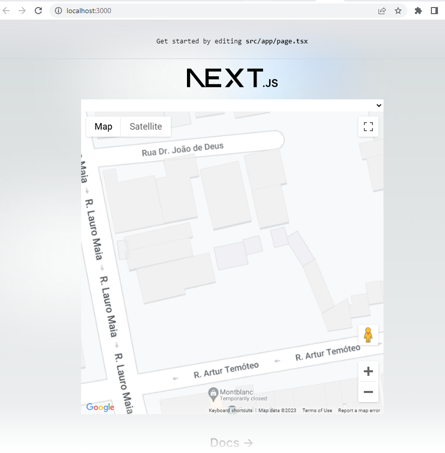

This is a [Next.js](https://nextjs.org/) project bootstrapped with [`create-next-app`](https://github.com/vercel/next.js/tree/canary/packages/create-next-app).

## Getting Started

First, run the development server:

```bash
npm run dev
# or
yarn dev
# or
pnpm dev
```

Open [http://localhost:3000](http://localhost:3000) with your browser to see the result.

You can start editing the page by modifying `app/page.tsx`. The page auto-updates as you edit the file.

[http://localhost:3000/api/hello](http://localhost:3000/api/hello) is an endpoint that uses [Route Handlers](https://beta.nextjs.org/docs/routing/route-handlers). This endpoint can be edited in `app/api/hello/route.ts`.

This project uses [`next/font`](https://nextjs.org/docs/basic-features/font-optimization) to automatically optimize and load Inter, a custom Google Font.

## Learn More

To learn more about Next.js, take a look at the following resources:

- [Next.js Documentation](https://nextjs.org/docs) - learn about Next.js features and API.
- [Learn Next.js](https://nextjs.org/learn) - an interactive Next.js tutorial.

You can check out [the Next.js GitHub repository](https://github.com/vercel/next.js/) - your feedback and contributions are welcome!

## Deploy on Vercel

The easiest way to deploy your Next.js app is to use the [Vercel Platform](https://vercel.com/new?utm_medium=default-template&filter=next.js&utm_source=create-next-app&utm_campaign=create-next-app-readme) from the creators of Next.js.

Check out our [Next.js deployment documentation](https://nextjs.org/docs/deployment) for more details.

## Added library 
- papaparse
    - handle CSV import
- csv-loader, dsv-loader
    - handle loading CSV
- Axios
    - handle requests. friendlier API than vanilla fetch, handle errors, etc.
- @react-google-maps/api
    - Follow this [link](https://www.npmjs.com/package/@react-google-maps/api)

## Rest API endpoint:
  - /api/riskinfo
      - get endpoint for fetching the data, intermediate layer to prep for fetching this data from an external source


## Tasks

### Problem 1: Implement a Map with Location Markers and Risk Indicators
1. Run `npm run dev` and before please do `npm Install`
2. App will automatically Load and parse the sample datasets.
3. After that, app will integrate a mapping library (e.g., Mapbox, Leaflet, Google Maps).
4. After, Implemented a control for users to select different decades.
5. Display the locations (Lat, Long) from the dataset as markers on the map of a given decade year.
6. Color-code the markers based on their Risk Rating (climate risk score) derived from the dataset.
7. Add interactivity to the map, such as zooming and panning, and display a tooltip with the Asset Name and Business Category on marker hover.

##output of the app

